# Лабораторная работа №4

### Задание 1

- Задание: *Написать свою функцию преобразования Фурье (прямое и обратное) используя «лобовой подход».*

Собственное одномерное преобразование Фурье реализовано в функции customDft, все сделано согласно формуле одномерного преобразования: по X и по Y, для чего введен соответствующий enum, для преобразования по координате Y исходное изображение транспонируется. На каждом шаге цикла вычисляется показатель экспоненты, а затем непосредственно ее значение, для хранения которого используется тип std::complex(double). Функция возвращает магнитуду. В той же функции реализовано обратное преобразование по соответстующему флагу is_inverse, по которому происходит изменение знака в показателе экспоненты.

На рисунках приведены (слева направо): исходное изображение, магнитуда после преобразование Фурье, магнитуда после встроенного в OpenCV преобразования, результат обратного преобразования Фурье.

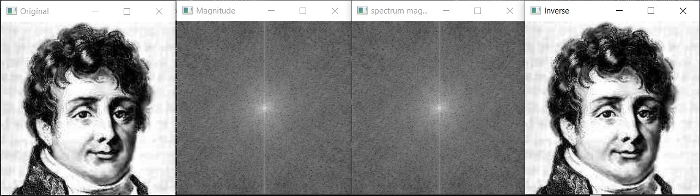

### Задание 2

- Задание: *Написать преобразование Фурье используя алгоритм Radix-2 (по основанию 2, или «Бабочка»).*

FFT реализовано в функциях fft2d, fft и recursiveFft, используется рекурсивный алгоритм, в функции fft сделан цикл, на каждой итерации которого в рекурсивную функцию отправляется одна строка исходного изображения, для прохождения по координате Y изображение так же, как в прошлом задании, транспонируется. Возможно, само по себе оно работает не так быстро, но по сравнению с "лобовым" подходом ускоряет работу в 7 раз.

На рисунках приведены (слева направо): исходное изображение, магнитуда после собственного быстрого преобразование Фурье, магнитуда после встроенного в OpenCV преобразования.

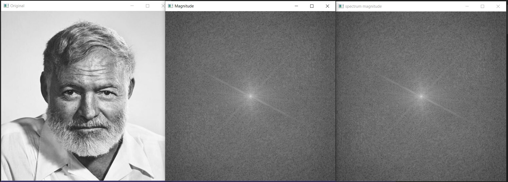

### Задание 3

- Задание: *Сравнить быстродействие из функций из первой и второй части, а также с преобразованием из OpenCV.*

В данном задании было проведено сравнение алгоритмов по времени работы. Реализованные алгоритмы оказались достаточно медленными, возможно, в связи с использованием матриц типа complex<double> и частых копирований изображений. Быстрое преобразование Фурье показывает ускорение работы в 7 раз.

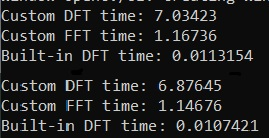

### Задание 7

- Задание: *Произвести по отдельности свёртку какого-либо изображения с ядром фильтров: Собеля (по горизонтали и вертикали), усредняющего (BoxFilter), Лапласа. Необходимо «красиво» вывести магнитуду образа Фурье исходного изображения и ядра свёртки. Полученные образы Фурье в результате выполнения свёртки следует обратно преобразовать в изображение. Сначала обрезаем полученное изображение (при помощи ROI) до первоначального размера. Полученное изображение нормализуем (с теми же параметрами, как и в примере, приведённом в теории) и выводим.*

Свертка производилась в частотной области, то есть сначала изображения дополнялись нулями во избежание ошибок перехлеста и для повышения оптимальности работы функции dft, затем были получены образы фурье изображения и фильтра, а затем произведено их умножение с помощью функции cv::mulSpectrums.

На рисунках представлена свертка изображения с фильтрами (сверху вниз: фильтр собеля по горизонтали, по вертикали, Box фильтр, фильтр Лапласа).

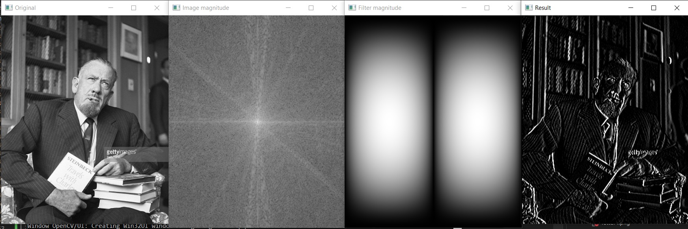
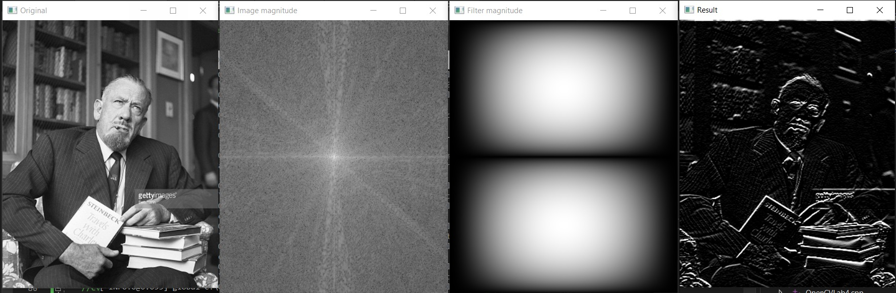
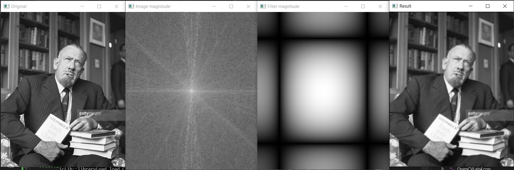
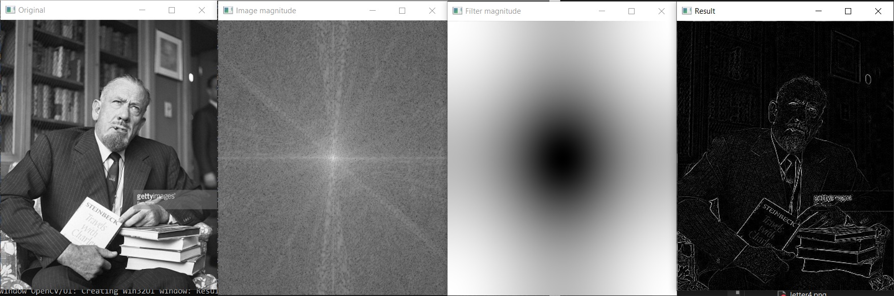

### Задание 8

- Задание: *Взять какое-нибудь изображение и в его спектре обрезать в одном случае элементы спектра с высокими частотами, в другом – низкими. А потом выполнить обратное преобразование на основе полученных спектров.*

Обрезание частот реализовано в функции lowHighPassFilter, на изображении рисуется черный круг который обрезает низкие частоты или же, наоборот, все вокруг круга заполняется черным - обрезаются высокие частоты.

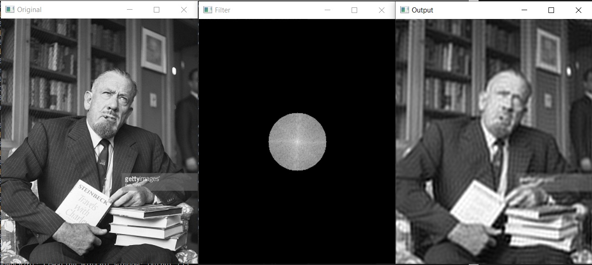

### Задание 9

- Задание: *Провести корреляцию (сравнение) изображений автомобильных номеров по очереди с 3-мя символами. Полученный образ Фурье обратно преобразовать в обычное изображение. Найти на нём наибольшее значение, которое принимают элементы. Отнять от этого значения небольшое число (около 0.01). Использовать полученное число в качестве порога для пороговой фильтрации от полученного изображения.*

Нахождение букв на номерах производится при помощи функции findInNumberPlate. Изображения так же, как и в случае со сверткой, дополняются нулями во избежание ошибок перехлеста и для оптимизации работы функции dft. В данном случае, после получения образов Фурье в функии mulSpectrums применялся флаг для использования у второго Фурье-образа комплексно-сопряженных значений.

На рисунках ниже представлены результаты поиска номеров.

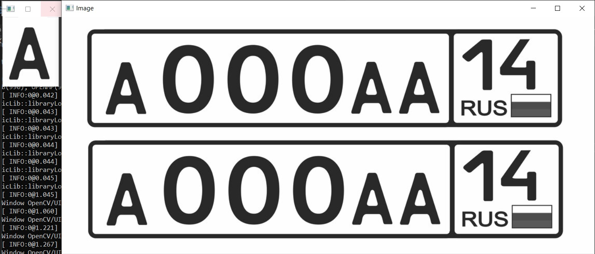
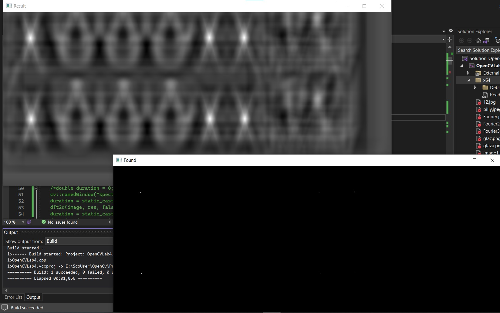
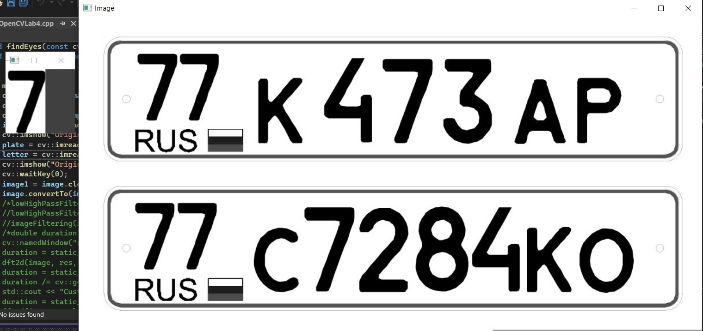
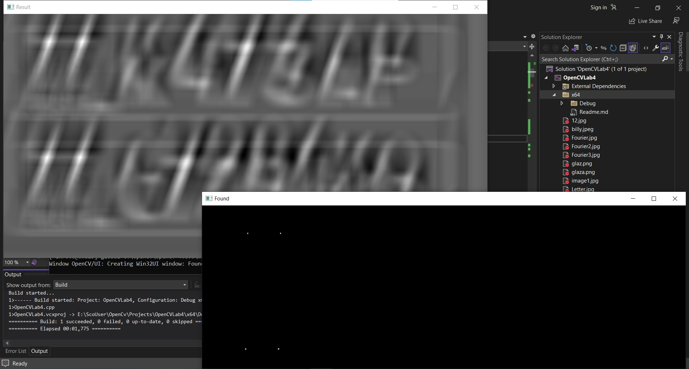
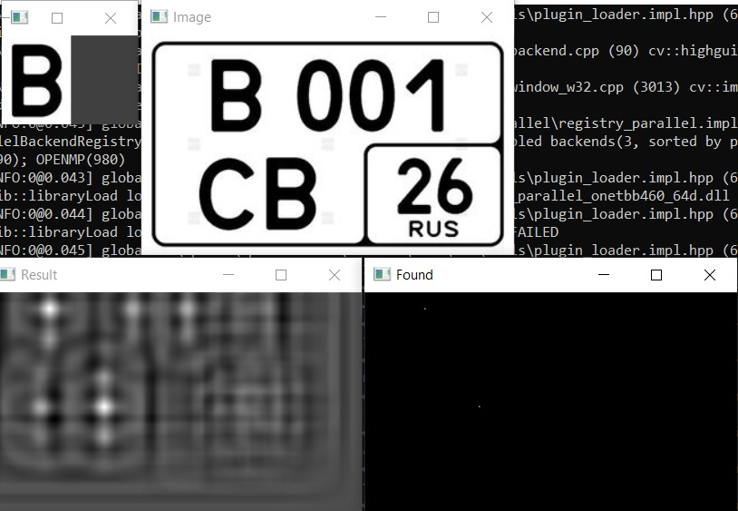

### Дополнительное задание, поиск глаз

Функция с поиском букв на номерах применительно к глазам не заработала, находились не наиболее совпадающие места, а места с наибольшей интенсивностью, так что для решения данной проблемы из шаблона и изображения были вычтены средние значения их интенсивностей, перед тем как была проведена корреляция. Для номеров затем было добавлено то же самое, чтобы улучшить качество нахождения. В итоге, для решения двух последних заданий была сделана одна функция matchTemplate, предыдущие функции тоже сохранены.

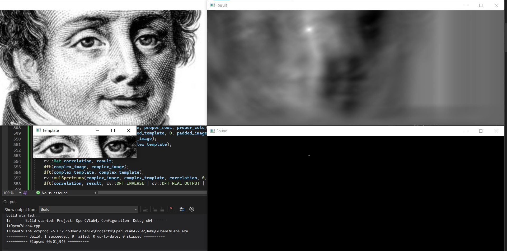
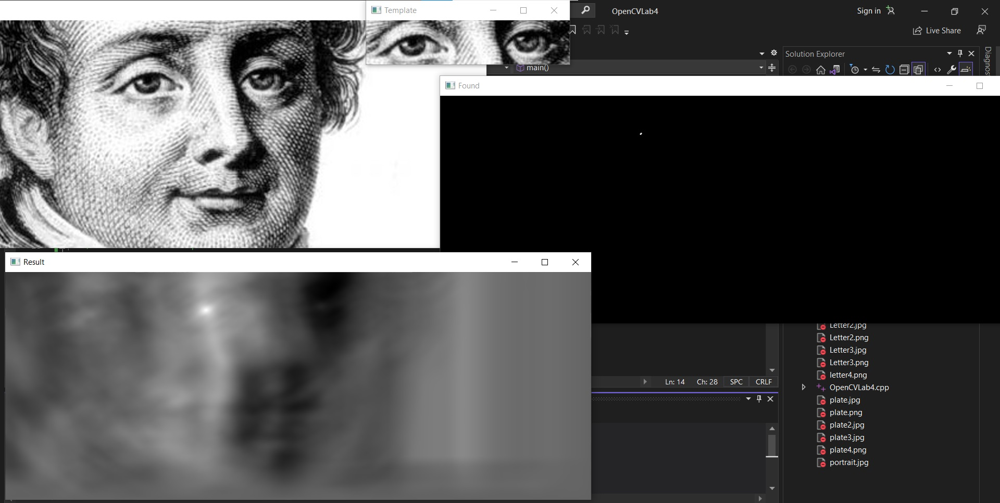
