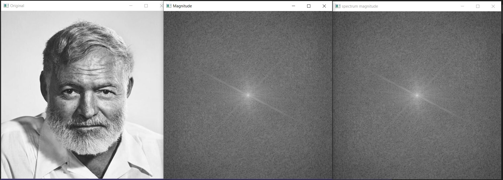

# Лабораторная работа №5

### Задание 1

- Задание: *Откалибровать собственную камеру при помощи доски aruco*

Код для калибровки был взят из файла calibrate_camera.cpp - примера, который идет вместе с ArUco, - и немного изменен. В результате получен файл с параметрами камеры - calibration.xml.

Пример работы на видео и результат калибровки:

### Задание 2

- Задание: *Откалибровать с помощью Calibration Toolbox (Matlab)*

В Matlab калибровка производилась при помощи шахматной доски, результат представлен на рисунке ниже. Как видно из двух файлов с результатами ошибка репроекции при калибровке с помощью Calibration Toolbox ниже, но стоит учитывать, что калибровка проводилась на большей выборке фотографии, не напрямую из видеопотока, что снижает дрожание камеры и/или доски при калибровке, при другом освещении и на зафиксированной поверхности, поэтому средняя ошибка репроекции близка к 0,1.

Пример работы и результат калибровки:

### Задание 3

- Задание: *Сгенерировать маркер Aruco из понравившегося словаря*

Генерация маркера осуществляется функцией createMarker, которая сохраняет его в файле "marker.png" (лежит в папке images).

### Задание 4

- Задание: *Написать программу, которая бы детектировала маркер на изображении и рисовать куб с основанием в виде маркера (куб должен быть спроецирован на плоскость изображения и иметь различные цвета ребер). Используйте захват видеопотока с камеры (VideoCapture), чтобы получать изображения.*

Реализованы функции detectMarker и drawCubes. Сначала загружаются параметры камеры и данные из файла с параметрами детекции, затем детектируются маркеры, находятся координаты их углов, после чего при помощи функции estimatePoseSingleMarkers находятся матрицы преобразований из системы координат маркера к системе координат камеры. Затем задаются координаты вершин куба в системе координат маркера и при помощи функции projectPoints проецируются на изображение, полученное с камеры. Потом по найденным координатам точек на изображении рисуется куб с ребрами разного цвета.

